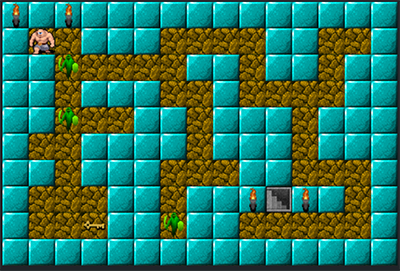

# The way to the exit

[The way to the exit](https://elicasama.github.io/the_way_to_exit/) es un prototipo para un juego de mazmorras.

⚠️ - Es un prototipo, solo muestra un nivel del juego.

## El Proyecto

El proyecto consistió en tomar el código básico de un juego estilo puzzle y hacer el refactor del mismo.

El desarrollo está realizado en JavaScript y HTML  

## El juego

Usando las flechas del teclado ayuda a nuestro heroe a sortear a los enemigos ☠️, recuperar la 🗝️ y salir de la mazmorra 🏆

## Desafíos

En el proceso aprendí

- Armado de mapas de juego, animación por código.
- Colisiones y control de personajes por teclado.
- Uso de librerías externas

## Recursos

- Imágenes: [OpenGamArt.Com](https://opengameart.org/)

- Líbrería: [Keypress](https://dmauro.github.io/Keypress)
